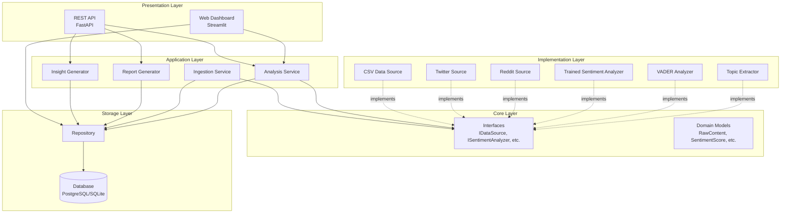

# Design Document

## Overview

The Vibe Optimizer platform is built on a layered architecture following SOLID principles. The system consists of five primary layers:

1. **Core Layer**: Domain models and interfaces with no external dependencies
2. **Data Layer**: Ingestion services and data source adapters
3. **Analysis Layer**: NLP processing including sentiment analysis and topic extraction
4. **Storage Layer**: Repository pattern implementation for data persistence
5. **Presentation Layer**: REST API and web dashboard for data access and visualization

The architecture emphasizes dependency inversion, where high-level modules depend on abstractions rather than concrete implementations. This enables easy extension (new data sources, analyzers) without modifying existing code.

## Architecture

### System Architecture Diagram



### Data Flow

1. **Ingestion Flow**: Data Sources → Ingestion Service → Repository → Database
2. **Analysis Flow**: Repository → Analysis Service → Sentiment Analyzer + Topic Extractor → Repository
3. **Insight Flow**: Repository → Insight Generator → Repository
4. **Visualization Flow**: Repository → Dashboard/API → User
5. **Reporting Flow**: Repository → Report Generator → Email Service → Recipients

## Components and Interfaces

### Core Interfaces

#### IDataSource
```python
class IDataSource(ABC):
    @abstractmethod
    def fetch_content(
        self, 
        query: str, 
        since: Optional[datetime] = None,
        limit: int = 100
    ) -> List[RawContent]:
        """Fetch content from the source."""
        pass
    
    @abstractmethod
    def get_source_type(self) -> SourceType:
        """Return the source type identifier."""
        pass
```

**Implementations**:
- `CSVDataSource`: Reads from CSV files with configurable columns
- `TwitterSource`: Fetches tweets via Twitter API (requires API keys)
- `RedditSource`: Fetches posts/comments via Reddit API (requires API keys)
- `ReviewSource`: Fetches product reviews from various platforms

#### ISentimentAnalyzer
```python
class ISentimentAnalyzer(ABC):
    @abstractmethod
    def analyze(self, text: str) -> SentimentScore:
        """Analyze sentiment of given text."""
        pass
```

**Implementations**:
- `TrainedSentimentAnalyzer`: Uses custom-trained scikit-learn model
- `TransformerSentimentAnalyzer`: Uses Hugging Face transformers (DistilBERT)
- `VaderSentimentAnalyzer`: Uses NLTK VADER (rule-based)

#### ITopicExtractor
```python
class ITopicExtractor(ABC):
    @abstractmethod
    def extract_topics(self, texts: List[str], num_topics: int = 5) -> List[Topic]:
        """Extract topics from a collection of texts."""
        pass
    
    @abstractmethod
    def assign_topics(self, text: str, topics: List[Topic]) -> List[Topic]:
        """Assign relevant topics to a single text."""
        pass
```

#### IRepository
```python
class IRepository(ABC):
    @abstractmethod
    def save(self, entity: Any) -> str:
        """Save an entity and return its ID."""
        pass
    
    @abstractmethod
    def get_by_id(self, entity_id: str) -> Optional[Any]:
        """Retrieve entity by ID."""
        pass
    
    @abstractmethod
    def find(self, filters: Dict[str, Any]) -> List[Any]:
        """Find entities matching filters."""
        pass
    
    @abstractmethod
    def delete(self, entity_id: str) -> bool:
        """Delete an entity."""
        pass
```

### Service Components

#### IngestionService
**Responsibility**: Orchestrate data ingestion from multiple sources

**Dependencies**:
- `sources: List[IDataSource]` - Configured data sources
- `repository: IRepository` - For persisting raw content

**Key Methods**:
- `ingest_all(query, since, limit_per_source)` - Ingest from all sources
- `ingest_from_csv(csv_path, query, since, limit)` - Convenience method for CSV
- `add_source(source)` - Dynamically add data source
- `remove_source(source_type)` - Remove data source

**Algorithm**:
```
FOR each source in sources:
    TRY:
        content = source.fetch_content(query, since, limit)
        FOR each item in content:
            repository.save(item)
    CATCH error:
        log error and continue with next source
```

#### AnalysisService
**Responsibility**: Coordinate NLP analysis pipeline

**Dependencies**:
- `sentiment_analyzer: ISentimentAnalyzer` - For sentiment classification
- `topic_extractor: ITopicExtractor` - For topic extraction
- `repository: IRepository` - For persisting analyzed content

**Key Methods**:
- `analyze_content(raw_content)` - Run full analysis pipeline

**Algorithm**:
```
all_texts = [content.text for content in raw_content]
topics = topic_extractor.extract_topics(all_texts)

FOR each content in raw_content:
    sentiment = sentiment_analyzer.analyze(content.text)
    assigned_topics = topic_extractor.assign_topics(content.text, topics)
    entities = extract_entities(content.text)
    
    analyzed = AnalyzedContent(
        raw_content=content,
        sentiment=sentiment,
        topics=assigned_topics,
        entities=entities,
        processed_at=now()
    )
    
    repository.save(analyzed)
```

#### TrainedSentimentAnalyzer
**Responsibility**: Classify sentiment using trained scikit-learn model

**State**:
- `model: sklearn classifier` - Trained classification model
- `vectorizer: TfidfVectorizer` - Text vectorization

**Key Methods**:
- `analyze(text)` - Classify sentiment and calculate scores
- `_load_model()` - Load model and vectorizer from disk
- `_calculate_intensity(probabilities, label)` - Calculate sentiment strength
- `_calculate_compound_score(probabilities)` - Calculate -1 to 1 score

**Sentiment Calculation Algorithm**:
```
text_vec = vectorizer.transform([text])
prediction = model.predict(text_vec)[0]
probabilities = model.predict_proba(text_vec)[0]

confidence = max(probabilities)
label = SentimentLabel(prediction)

# Intensity: inverse of neutral probability, scaled by confidence
neutral_prob = probabilities[neutral_index]
intensity = (1.0 - neutral_prob) * confidence

# Compound: positive probability - negative probability
compound = probabilities[positive_index] - probabilities[negative_index]

RETURN SentimentScore(label, confidence, intensity, compound)
```

#### InsightGenerator
**Responsibility**: Generate actionable business insights from analyzed data

**Configuration**:
- `sentiment_drop_threshold: float` - Threshold for detecting sentiment drops (default: 0.15)
- `negative_spike_threshold: float` - Threshold for negative spikes (default: 0.25)
- `topic_frequency_threshold: int` - Threshold for trending topics (default: 10)

**Key Methods**:
- `generate_insights(analyzed_content, time_window)` - Generate insights

**Insight Generation Algorithm**:
```
insights = []

# Analyze sentiment trends
current_sentiment = calculate_average_sentiment(analyzed_content, current_period)
previous_sentiment = calculate_average_sentiment(analyzed_content, previous_period)

IF (previous_sentiment - current_sentiment) > sentiment_drop_threshold:
    insights.append(create_risk_insight("Sentiment Drop Detected", ...))

# Detect negative spikes
negative_ratio = count_negative(analyzed_content) / total_count
IF negative_ratio > negative_spike_threshold:
    insights.append(create_critical_insight("Negative Sentiment Spike", ...))

# Identify trending topics
topic_frequencies = count_topics(analyzed_content)
FOR topic, count in topic_frequencies:
    IF count > topic_frequency_threshold:
        insights.append(create_trend_insight(f"Trending: {topic}", ...))

RETURN insights
```

## Data Models

### Domain Models

#### RawContent
```python
@dataclass
class RawContent:
    id: str
    source_type: SourceType
    content: str
    author: Optional[str]
    timestamp: datetime
    metadata: Dict[str, Any]
    url: Optional[str] = None
```

#### SentimentScore
```python
@dataclass
class SentimentScore:
    label: SentimentLabel  # POSITIVE, NEUTRAL, NEGATIVE
    score: float  # Confidence 0-1
    intensity: float  # Strength 0-1
    compound_score: Optional[float] = None  # Overall -1 to 1
```

#### AnalyzedContent
```python
@dataclass
class AnalyzedContent:
    raw_content: RawContent
    sentiment: SentimentScore
    topics: List[Topic]
    entities: List[str]
    processed_at: datetime
```

#### Insight
```python
@dataclass
class Insight:
    id: str
    title: str
    description: str
    insight_type: str  # 'trend', 'risk', 'opportunity', 'complaint'
    severity: str  # 'low', 'medium', 'high', 'critical'
    supporting_data: Dict[str, Any]
    created_at: datetime
    actionable_recommendations: List[str]
```

### Database Models

The system uses SQLAlchemy ORM with separate database models from domain models:

- `RawContentModel` - Maps to `raw_content` table
- `AnalyzedContentModel` - Maps to `analyzed_content` table
- `InsightModel` - Maps to `insights` table
- `ReportModel` - Maps to `reports` table

**Mapping Strategy**: Repository layer converts between domain models and database models.

## Correctness Properties

*A property is a characteristic or behavior that should hold true across all valid executions of a system—essentially, a formal statement about what the system should do. Properties serve as the bridge between human-readable specifications and machine-verifiable correctness guarantees.*


### Property 1: CSV Parsing Completeness
*For any* valid CSV file with properly formatted rows, parsing should create a RawContent object for each valid row, skipping only rows with invalid timestamps.
**Validates: Requirements 1.1, 1.2, 1.3**

### Property 2: Query Filtering Correctness
*For any* query string and collection of content, all returned items must contain the query string (case-insensitive), and no items without the query string should be returned.
**Validates: Requirements 1.4**

### Property 3: Date Filtering Correctness
*For any* since date and collection of content, all returned items must have timestamps after the since date, and no items with earlier timestamps should be returned.
**Validates: Requirements 1.5**

### Property 4: Limit Enforcement
*For any* limit value and data source, the number of returned content items must be less than or equal to the limit.
**Validates: Requirements 1.6**

### Property 5: Source Independence
*For any* set of configured data sources, if one source fails, the system should still successfully ingest from all other sources.
**Validates: Requirements 1.7, 1.8**

### Property 6: Ingestion Persistence Round-Trip
*For any* content item ingested, querying the repository immediately after ingestion should return an equivalent content item.
**Validates: Requirements 1.9**

### Property 7: Sentiment Score Structure Completeness
*For any* text input, the sentiment analyzer must return a SentimentScore with all required fields: label (Positive/Negative/Neutral), confidence, intensity, and compound_score.
**Validates: Requirements 2.1, 2.2**

### Property 8: Sentiment Score Range Invariants
*For any* text input, the sentiment scores must satisfy these invariants:
- confidence ∈ [0, 1]
- intensity ∈ [0, 1]
- compound_score ∈ [-1, 1]
**Validates: Requirements 2.3, 2.4, 2.5**

### Property 9: Model Persistence Round-Trip
*For any* trained model and vectorizer, after saving to disk and loading back, the analyzer should produce equivalent sentiment scores for the same input text.
**Validates: Requirements 3.4**

### Property 10: Analysis Completeness
*For any* list of raw content items, the analysis service should produce exactly one AnalyzedContent object for each input item.
**Validates: Requirements 4.1**

### Property 11: Topic Assignment Validity
*For any* analyzed content with assigned topics, all assigned topics must be members of the extracted topic list for that batch.
**Validates: Requirements 4.3**

### Property 12: AnalyzedContent Structure Completeness
*For any* analyzed content, it must contain all required fields: raw_content, sentiment, topics, entities, and processed_at timestamp.
**Validates: Requirements 4.4, 4.6**

### Property 13: Topic Structure Completeness
*For any* extracted topic, it must contain keywords and a relevance score.
**Validates: Requirements 4.7, 4.8**

### Property 14: Analysis Persistence Round-Trip
*For any* analyzed content persisted to the repository, querying by ID should return an equivalent AnalyzedContent object.
**Validates: Requirements 4.5**

### Property 15: Insight Generation Threshold Behavior
*For any* analyzed content with sentiment drop exceeding the threshold, the system must generate at least one risk insight.
**Validates: Requirements 7.2, 7.3**

### Property 16: Insight Structure Completeness
*For any* generated insight, it must contain all required fields: title, description, insight_type (one of: trend/risk/opportunity/complaint), severity (one of: low/medium/high/critical), supporting_data, and actionable_recommendations.
**Validates: Requirements 7.5, 7.6, 7.7, 7.8, 7.9**

### Property 17: Insight Persistence Round-Trip
*For any* generated insight persisted to the repository, querying by ID should return an equivalent Insight object.
**Validates: Requirements 7.10**

### Property 18: Repository CRUD Consistency
*For any* entity saved to the repository:
- save() returns a non-empty ID
- get_by_id(ID) returns an equivalent entity
- delete(ID) returns true
- get_by_id(ID) after delete returns None
**Validates: Requirements 9.2, 9.3, 9.6**

### Property 19: Repository Find Filtering
*For any* filter dictionary, all entities returned by find(filters) must match all filter criteria, and no matching entities should be omitted.
**Validates: Requirements 9.4, 9.5**

### Property 20: Dashboard Metric Calculation Consistency
*For any* collection of analyzed content, the sum of positive, neutral, and negative counts must equal the total count.
**Validates: Requirements 5.1**

### Property 21: Dashboard Sentiment Determination
*For any* collection of analyzed content:
- If positive_count > negative_count, overall sentiment is Positive
- If negative_count > positive_count, overall sentiment is Negative
- If positive_count == negative_count, overall sentiment is Neutral
**Validates: Requirements 5.2, 5.3, 5.4**

### Property 22: Dashboard Date Filtering
*For any* date range [start_date, end_date] and collection of content, filtered results must only include items with timestamps within the range (inclusive).
**Validates: Requirements 5.11**

### Property 23: Dashboard Source Filtering
*For any* set of selected source types and collection of content, filtered results must only include items from the selected sources.
**Validates: Requirements 5.12**

### Property 24: Dashboard Search Filtering
*For any* search query and collection of content, filtered results must only include items where the content text contains the query (case-insensitive).
**Validates: Requirements 5.13**

## Error Handling

### Error Handling Strategy

The system implements a layered error handling approach:

1. **Data Layer Errors**: Validation errors, parsing errors, connection failures
2. **Analysis Layer Errors**: Model loading failures, analysis failures
3. **Storage Layer Errors**: Database connection errors, constraint violations
4. **API Layer Errors**: Request validation errors, authentication errors

### Error Categories

#### Validation Errors
- Invalid timestamp formats in CSV data
- Invalid configuration values
- Missing required fields

**Handling**: Skip invalid items, log warning, continue processing

#### Resource Errors
- Missing model files
- Database connection failures
- Missing CSV files

**Handling**: Raise exception with descriptive message, fail fast

#### Processing Errors
- Sentiment analysis failures on specific text
- Topic extraction failures

**Handling**: Log error, use fallback values or skip item, continue processing

#### External Service Errors
- API rate limits (Twitter, Reddit)
- Email delivery failures
- Network timeouts

**Handling**: Retry with exponential backoff, log error, return failure status

### Error Logging

All errors are logged with:
- Timestamp
- Severity level (ERROR, WARNING, INFO)
- Component name
- Error message
- Stack trace (for exceptions)
- Context information (e.g., source type, content ID)

### Graceful Degradation

The system is designed to continue operating when non-critical components fail:

- If one data source fails, others continue
- If sentiment analysis fails for one item, others are processed
- If email delivery fails, report is still generated and stored
- If dashboard cannot load data, displays error message but remains functional

## Testing Strategy

### Testing Approach

The system uses a dual testing approach combining unit tests and property-based tests:

**Unit Tests**: Verify specific examples, edge cases, and error conditions
- Specific CSV parsing scenarios (empty files, malformed data)
- Specific sentiment analysis examples (known positive/negative text)
- Error handling scenarios (missing files, invalid input)
- Integration points between components

**Property-Based Tests**: Verify universal properties across all inputs
- CSV parsing with randomly generated valid/invalid data
- Sentiment analysis with randomly generated text
- Repository operations with randomly generated entities
- Filtering operations with random queries and data

### Property-Based Testing Framework

**Framework**: Hypothesis (Python property-based testing library)

**Configuration**:
- Minimum 100 iterations per property test
- Each test tagged with: `Feature: vibe-optimizer-platform, Property {number}: {property_text}`

**Example Property Test Structure**:
```python
from hypothesis import given, strategies as st
import pytest

@given(
    csv_data=st.lists(
        st.tuples(
            st.text(min_size=1),  # content
            st.datetimes(),  # timestamp
            st.sampled_from(['twitter', 'reddit', 'reviews'])  # source
        ),
        min_size=1,
        max_size=100
    )
)
@pytest.mark.property_test
def test_csv_parsing_completeness(csv_data):
    """
    Feature: vibe-optimizer-platform, Property 1: CSV Parsing Completeness
    For any valid CSV file, parsing should create a RawContent object for each valid row.
    """
    # Create CSV file from generated data
    csv_file = create_csv_from_data(csv_data)
    
    # Parse CSV
    source = CSVDataSource(csv_file)
    results = source.fetch_content(limit=len(csv_data))
    
    # Verify: one RawContent per valid row
    assert len(results) == len([row for row in csv_data if is_valid_row(row)])
```

### Test Coverage Goals

- **Unit Test Coverage**: 85%+ of code lines
- **Property Test Coverage**: All 24 correctness properties
- **Integration Test Coverage**: All major workflows (ingestion → analysis → insights → reporting)

### Test Organization

```
tests/
├── unit/
│   ├── test_ingestion_service.py
│   ├── test_sentiment_analyzer.py
│   ├── test_analysis_service.py
│   ├── test_insight_generator.py
│   └── test_repository.py
├── integration/
│   ├── test_ingestion_to_analysis.py
│   ├── test_analysis_to_insights.py
│   └── test_end_to_end_workflow.py
├── property/
│   ├── test_csv_parsing_properties.py
│   ├── test_sentiment_analysis_properties.py
│   ├── test_filtering_properties.py
│   └── test_repository_properties.py
└── conftest.py  # Shared fixtures
```

### Test Data Strategy

**Unit Tests**: Use fixed, hand-crafted test data
- Known positive/negative sentiment examples
- Edge cases (empty strings, very long text, special characters)
- Specific error scenarios

**Property Tests**: Use generated test data
- Hypothesis strategies for generating valid/invalid CSV data
- Random text generation for sentiment analysis
- Random date ranges for filtering tests
- Random entity generation for repository tests

### Mocking Strategy

- Mock external APIs (Twitter, Reddit) in unit tests
- Mock database in unit tests, use in-memory SQLite for integration tests
- Mock email service in all tests
- Do not mock core business logic (sentiment analyzer, insight generator)

### Continuous Integration

Tests run automatically on:
- Every commit (unit tests only)
- Pull requests (full test suite including property tests)
- Nightly builds (extended property tests with 1000+ iterations)

## Implementation Notes

### Technology Stack

- **Language**: Python 3.10+
- **NLP**: spaCy, transformers, scikit-learn, NLTK
- **ML**: scikit-learn, torch
- **Data**: pandas, numpy
- **Database**: SQLAlchemy, Alembic (PostgreSQL/SQLite)
- **API**: FastAPI, uvicorn, pydantic
- **Dashboard**: Streamlit, Plotly
- **Scheduling**: APScheduler, Celery, Redis
- **Email**: SendGrid
- **Testing**: pytest, pytest-cov, pytest-asyncio, Hypothesis

### Development Workflow

1. **Setup**: Install dependencies, download spaCy models, configure environment
2. **Database**: Run migrations with Alembic
3. **Training**: Train sentiment model on domain data
4. **Testing**: Run test suite with pytest
5. **Development**: Implement features following TDD approach
6. **Integration**: Test end-to-end workflows
7. **Deployment**: Deploy API, dashboard, and workers

### Performance Considerations

- **Batch Processing**: Process content in batches of 100-1000 items
- **Caching**: Cache frequently accessed data (topics, insights)
- **Indexing**: Database indexes on timestamp, source_type, sentiment_label
- **Pagination**: API endpoints return paginated results (default 50 items)
- **Async Processing**: Use async/await for I/O-bound operations
- **Background Jobs**: Long-running tasks (ingestion, analysis) run as background jobs

### Security Considerations

- **API Keys**: Store in environment variables, never commit to version control
- **Database**: Use parameterized queries to prevent SQL injection
- **API**: Implement rate limiting and authentication
- **Input Validation**: Validate all user input using pydantic models
- **Error Messages**: Don't expose internal details in error messages

### Scalability Considerations

- **Horizontal Scaling**: API and workers can scale independently
- **Database**: Use connection pooling, read replicas for queries
- **Caching**: Use Redis for distributed caching
- **Message Queue**: Use Celery + Redis for distributed task processing
- **Load Balancing**: Use load balancer for API instances

### Monitoring and Observability

- **Logging**: Structured logging with context information
- **Metrics**: Track ingestion rate, analysis latency, error rates
- **Alerts**: Alert on high error rates, slow queries, failed jobs
- **Dashboards**: Monitoring dashboard for system health

